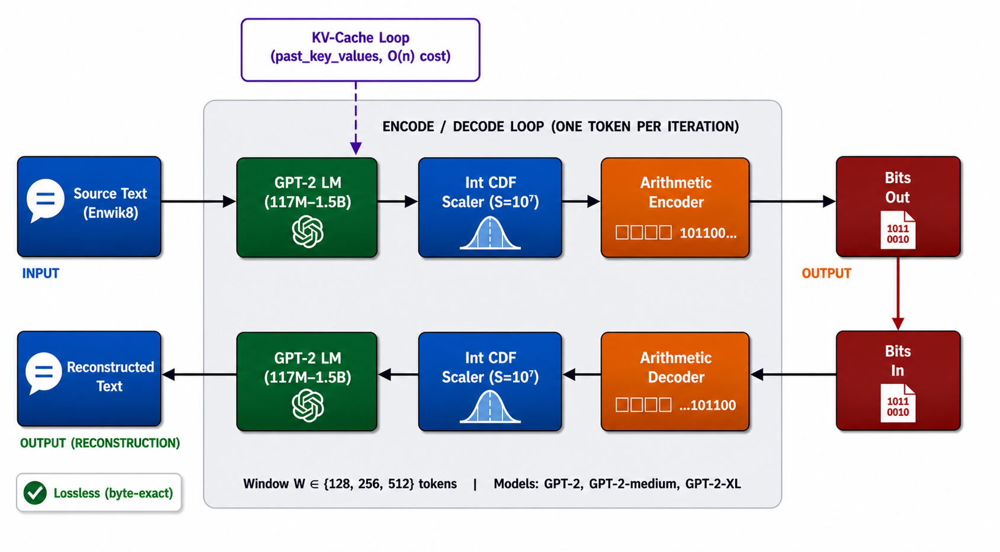
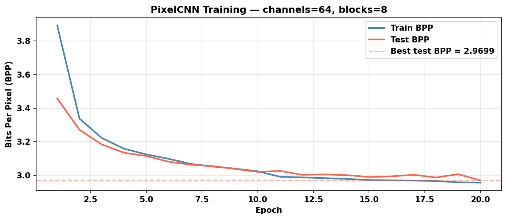
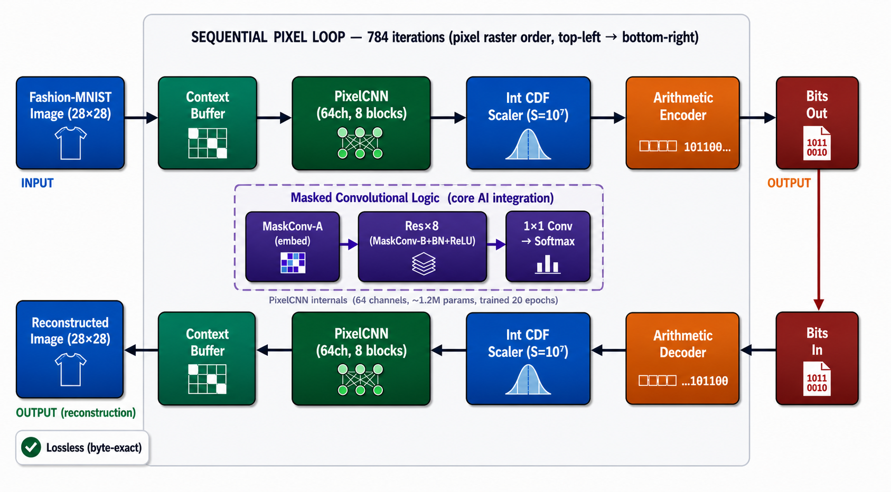

# Neural Probability Models as Arithmetic Coding Engines

**Data Compression Project**  

> *"Arithmetic coding is theoretically optimal — but only if the probability model is accurate."*

This project implements two parallel experiments that replace the statistical component of an arithmetic coder with a **neural network**. Rather than using n-gram counts or hand-crafted predictors, the coder queries a trained neural model at every symbol position and feeds the resulting probability distribution directly into a 32-bit integer arithmetic coder.

The approach is grounded in two seminal works:
- Delétang et al., [*Language Modeling Is Compression*](https://arxiv.org/abs/2309.10668), Google DeepMind, 2023
- van den Oord et al., [*Pixel Recurrent Neural Networks*](https://arxiv.org/abs/1601.06759), ICML 2016

---

## Repository Structure

```
.
├── figures/                        # Pipeline diagrams and training curves
│   ├── lm_pipeline.png
│   ├── pixelcnn_pipeline.png
│   └── training_curve.png
│
├── lm_arithmetic_coding/           # Experiment 1: GPT-2 + Arithmetic Coding on Enwik8
│   ├── arithmetic_coder.py         # 32-bit integer arithmetic encoder/decoder (E1/E2/E3)
│   ├── lm_compressor.py            # GPT-2 + KV-cache accelerated compressor
│   ├── baselines.py                # Shannon entropy, Huffman, gzip, bzip2, lzma
│   ├── evaluate.py                 # Main evaluation runner
│   ├── ablation_window.py          # Context window ablation (W ∈ {128, 256, 512})
│   ├── test_edge_cases.py          # Losslessness and CDF correctness tests
│   ├── download_data.py            # Download Enwik8
│   ├── project_runs.ipynb          # End-to-end experiment walkthrough
│   ├── requirements.txt
│   ├── data/                       # Created on first run (not committed — see note)
│   └── results/                    # Timestamped JSON + text reports
│
└── pixel_arithmetic_coding/        # Experiment 2: PixelCNN + Arithmetic Coding on Fashion-MNIST
    ├── pixelcnn.py                 # Masked convolutional PixelCNN model
    ├── train.py                    # Training script (20 epochs, Fashion-MNIST)
    ├── arithmetic_coder.py         # Same 32-bit coder, image domain
    ├── pixel_compressor.py         # Sequential 784-pass encoder/decoder
    ├── baselines.py                # Raw, Shannon entropy, gzip, PNG
    ├── evaluate.py                 # Main evaluation runner
    ├── test_edge_cases.py          # Edge case and losslessness tests
    ├── download_data.py            # Download Fashion-MNIST
    ├── pixel_runs.ipynb            # End-to-end experiment walkthrough
    ├── requirements.txt
    ├── checkpoints/                # Saved model weights
    └── results/                    # Timestamped JSON + text reports
```

> **Note on data files:** The Enwik8 dataset (~95 MB) is not committed. Run `python download_data.py` inside `lm_arithmetic_coding/` to fetch it automatically.

---

## Experiment 1 — GPT-2 Guided Arithmetic Coding on Text

### Core Idea

At each token position in the text, GPT-2 predicts `P(next_token | all previous tokens)` via a 50,257-class softmax. These probabilities are converted to an integer CDF and fed to a 32-bit arithmetic encoder. Total compressed bits ≈ Σ −log₂ P(tokenᵢ | context), approaching the true entropy of the source.

KV-cache is used to amortize the transformer cost to O(n) over the full sequence rather than O(n²).

### Setup

```bash
cd lm_arithmetic_coding
pip install -r requirements.txt
python download_data.py
```

### Running Experiments

```bash
# Theoretical BPC only — fast (~5 min on GPU)
python evaluate.py

# Condition B: prose-dominant segment (offset 300 KB)
python evaluate.py --offset 300000

# With actual encode + decode and losslessness verification
python evaluate.py --full-encode

# Larger model variants
python evaluate.py --model gpt2-medium
python evaluate.py --model gpt2-xl

# Context window ablation (W ∈ {128, 256, 512})
python ablation_window.py
python ablation_window.py --offset 300000

# Losslessness and CDF tests
python test_edge_cases.py
```

### Results

Measured on 50 KB of Enwik8, context window W = 512.

| Method | Cond. A BPC | Cond. A Ratio | Cond. B BPC | Cond. B Ratio |
|---|:---:|:---:|:---:|:---:|
| Static Huffman | 4.919 | 1.63× | 5.004 | 1.60× |
| gzip -9 | 3.013 | 2.66× | 3.128 | 2.56× |
| bzip2 -9 | 2.696 | 2.97× | 2.787 | 2.87× |
| LLM-AC GPT-2 | 1.118 | 7.16× | 1.181 | 6.77× |
| LLM-AC GPT-2-medium | 0.986 | 8.11× | 1.039 | 7.70× |
| **LLM-AC GPT-2-XL** | **0.874** | **9.15×** | **0.958** | **8.35×** |
| PAQ8 (state-of-the-art) | ~1.0 | ~8× | — | — |

**Condition A** (offset 0 KB): opening segment of Enwik8 — ~53% XML markup, ~47% prose. Comparable to the Hutter Prize leaderboard.  
**Condition B** (offset 300 KB): prose-dominant passage (Wikipedia articles on Abraham Lincoln / Aristotle) — ~6% XML, ~94% prose.

GPT-2-XL at BPC 0.874 surpasses PAQ8, the strongest general-purpose compressor, on prose text.

### Pipeline

```
Input text
    │
    ▼
GPT-2 tokenizer (BPE, vocab = 50,257)
    │
    ▼  for each token position i:
GPT-2 forward pass (KV-cache)
    │
    ▼
Softmax → P(·|context)  [50,257-dim]
    │
    ▼
Integer CDF  (scaled to 10,000,000 counts)
    │
    ▼
Arithmetic encoder  (32-bit, E1/E2/E3 rescaling)
    │
    ▼
Compressed bitstream
```



---

## Experiment 2 — PixelCNN Guided Arithmetic Coding on Images

### Core Idea

A PixelCNN predicts `P(pixel_{i,j} | all prior pixels in raster order)` via a 256-class softmax. For each of the 784 pixels in a 28×28 Fashion-MNIST image, the model's output is converted to a CDF and fed to the arithmetic coder. Encoding and decoding each require exactly 784 sequential forward passes.

The sequential pass design is a critical correctness requirement: a single-pass encoder fails due to floating-point non-commutativity across residual blocks, causing CDF mismatch at decode time and 0% lossless reconstructions. The 784-pass scheme guarantees identical model state on both sides.

### Setup

```bash
cd pixel_arithmetic_coding
pip install -r requirements.txt
python download_data.py   # Downloads Fashion-MNIST automatically
```

### Running Experiments

```bash
# Step 1 — Train PixelCNN (~10 min on a T4 GPU)
python train.py

# Step 2 — Theoretical BPP on 500 test images
python evaluate.py --n-images 500

# Step 3 — Full encode + decode with losslessness verification
python evaluate.py --full-encode --n-images 100

# Step 4 — Edge case tests
python test_edge_cases.py
```

### Results

| Method | BPP | Ratio | Notes |
|---|:---:|:---:|---|
| Raw (8 bpp) | 8.000 | 1.00× | Uncompressed baseline |
| gzip -9 | 4.814 | 1.66× | 500 test images |
| PNG (lossless) | 5.190 | 1.54× | 500 test images |
| Shannon entropy | 4.162 | 1.92× | Theoretical lower bound |
| PixelCNN-AC (theoretical) | 2.968 | 2.70× | 500 test images |
| **PixelCNN-AC (actual)** | **2.630** | **3.04×** | 5 images, 100% lossless |

Training converged from 3.892 BPP (epoch 1) to 2.957 BPP (epoch 20) with negligible train/test gap.



### PixelCNN Architecture

| Component | Details |
|---|---|
| Input layer | Type-A masked conv 7×7 (no self-connection) |
| Residual blocks | 8 × (Type-B masked conv 3×3 + BN + ReLU) |
| Output head | Two 1×1 convs → 256 logits per pixel |
| Feature channels | 64 |
| Parameters | ~1.2 M |
| Optimizer | Adam, lr = 1e-3 |
| LR schedule | StepLR ×0.5 at epoch 10 |
| Training | 20 epochs on Fashion-MNIST (60k images) |



---

## Arithmetic Coder

Both experiments share the same underlying 32-bit integer arithmetic coder (`arithmetic_coder.py`), implementing the Witten–Neal–Cleary algorithm with E1/E2/E3 rescaling to prevent range underflow.

| Component | Details |
|---|---|
| Precision | 32-bit integer arithmetic |
| Rescaling | E1 (lower half), E2 (upper half), E3 (middle third) |
| CDF scale | 10,000,000 counts (balances precision vs. overflow) |
| Smoothing | Laplace smoothing for zero-probability symbols |
| Guarantee | Lossless: decoded output bit-exact matches input |

---

## Key Findings

1. **Neural models dramatically outperform classical compressors.** GPT-2-XL achieves 9.15× compression on text, versus 2.97× for bzip2 — a 3× improvement. PixelCNN achieves 3.04× on Fashion-MNIST images, versus 1.54× for PNG.

2. **Model scale matters.** BPC drops from 1.118 (GPT-2) → 0.986 (GPT-2-medium) → 0.874 (GPT-2-XL), confirming that larger language models are better probability estimators.

3. **Context window affects compression quality.** Window ablation shows diminishing returns beyond W = 256 tokens for the opening XML-heavy segment, but continued improvement on prose-dominant text.

4. **Engineering decisions override AI proposals.** The sequential 784-pass scheme for image compression was a human decision that overrode the initial AI suggestion of a single-pass encoder — which produced 0/5 lossless reconstructions due to floating-point CDF drift.

5. **Compression and losslessness are jointly achievable.** All experiments achieve 100% lossless reconstruction, verified by byte-exact comparison of decoded output against the original.

---

## Requirements

### Experiment 1 (LM)
```
torch>=2.0.0
transformers>=4.35.0
numpy>=1.24.0
```

### Experiment 2 (PixelCNN)
```
torch>=2.0.0
torchvision>=0.15.0
numpy>=1.24.0
Pillow>=9.0.0
```

A CUDA-capable GPU is recommended. CPU execution is supported but slow for full encode/decode (each image requires 784 sequential forward passes).

---

## AI Integration

Both experiments use AI at **the algorithm level**, not just as a coding assistant:

- **GPT-2** is the entire probability model for the text compressor — it replaces n-gram statistics with a pretrained language model.
- **PixelCNN** is the entire probability model for the image compressor — it replaces DCT/LZ predictors with a learned autoregressive model.

Claude was used during development to design the E1/E2/E3 rescaling strategy and debug CDF precision issues. The full interaction log is documented in `ai_log.docx` (not committed).

---

## References

1. Delétang, G. et al. *Language Modeling Is Compression.* Google DeepMind, 2023. [arXiv:2309.10668](https://arxiv.org/abs/2309.10668)
2. van den Oord, A. et al. *Pixel Recurrent Neural Networks.* ICML, 2016. [arXiv:1601.06759](https://arxiv.org/abs/1601.06759)
3. Witten, I. H., Neal, R. M., & Cleary, J. G. *Arithmetic coding for data compression.* CACM, 1987.
4. Radford, A. et al. *Language Models are Unsupervised Multitask Learners.* OpenAI, 2019. (GPT-2)
5. Mahoney, M. *Large text compression benchmark (Hutter Prize).* [http://mattmahoney.net/dc/text.html](http://mattmahoney.net/dc/text.html)
